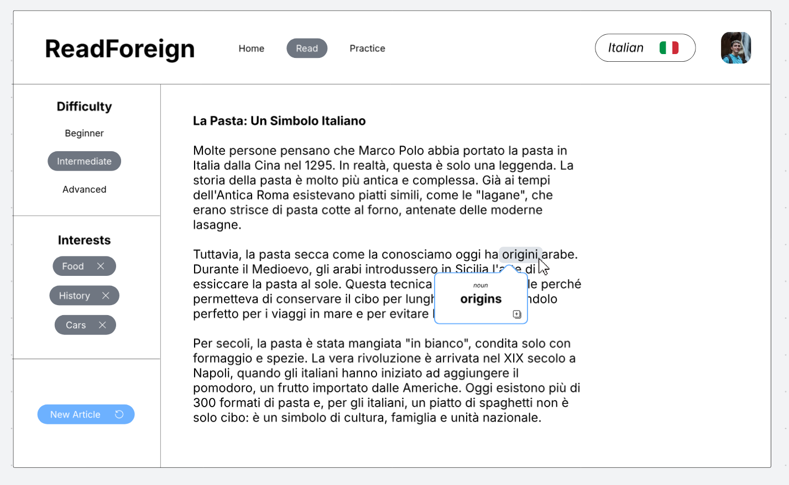

# ReadForeign

[Project Notes](notes.md)

Keep your foreign language proficiency afloat.

### Elevator pitch

Many people who have learned foreign languages (RMs) struggle to find opportunities to practice. While the overall best way to practice is speaking, other methods such as reading can provide a solid practice, especially with strengthening vocabulary. 

This app will allow users to read about topics they find interesting at a difficulty that pushes them to learn new words. Once they've accumulated enough unknown words, they'll be able to memorize them and quiz themselves on what they've learned. 

The process of reading, translating, and memorizing helped me immensely when learning Spanish and Q'eqchi'. My goal is to streamline the process into a single, specialized app.

### Design

### MVP (Minimum Viable Product)

1. User selects a target language
2. User inputs their interests
3. User selects a difficulty:
   - Easy: a child could understand it
   - Intermediate: a teenager could understand it
   - Advanced: university or professional level writing
4. Based on the user's interests and selected difficulty, AI will retrieve a short article in the target language for the user to read. In the background, an English version will also be retrieved. 
5. As the user is reading, they can select words they don't understand and get definitions for them. The user can save these words to a memorization bucket. 
6. The user can quiz themselves on the words that they've saved to the bucket.

### Technologies

I am going to use the required technologies in the following ways:

- **HTML** - For basic site structure and layout. There will be three pages. One for login, reading, and practicing.
- **CSS** - For UI and visuals. 
- **React** - Will make the screen interactive. Users will be able to get quick definitions of words that they select. They will be able to save words for later.
- **Service** - Server endpoints will be:
    - Retrieving user's preferences (langauge, difficulty, and interests)
    - Saving user's preferences
    - Saving user's words
    - Deleting user's words
    - Calling an OpenRouter AI API to get the articles
    - Register/Login/Logout. User needs to be logged in with an account to use the application.
- **DB/Login** - Store user's account information, preferences, and saved words. 
- **WebSocket** - Shows a live count of saved words. 

## 🚀 AWS deliverable

For this deliverable I did the following:

- [x] **Server deployed and accessible with custom domain name** - [ReadForeign](https://readforeign.click).

## 🚀 HTML deliverable

For this deliverable I did the following:

- [x] **HTML pages** 
- [x] **Proper HTML element usage** 
- [x] **Links** 
- [x] **Text** 
- [x] **3rd party API placeholder** 
- [x] **Images** 
- [x] **Login placeholder** 
- [x] **DB data placeholder** 
- [x] **WebSocket placeholder** 

## 🚀 CSS deliverable

For this deliverable I did the following. I checked the box `[x]` and added a description for things I completed.

- [x] **Visually appealing colors and layout. No overflowing elements.**
- [x] **Use of a CSS framework**
- [x] **All visual elements styled using CSS**
- [x] **Responsive to window resizing using flexbox and/or grid display**
- [x] **Use of a imported font**
- [x] **Use of different types of selectors including element, class, ID, and pseudo selectors**

## 🚀 React part 1: Routing deliverable

For this deliverable I did the following. I checked the box `[x]` and added a description for things I completed.

- [ ] **Bundled using Vite** - I did not complete this part of the deliverable.
- [ ] **Components** - I did not complete this part of the deliverable.
- [ ] **Router** - I did not complete this part of the deliverable.

## 🚀 React part 2: Reactivity deliverable

For this deliverable I did the following. I checked the box `[x]` and added a description for things I completed.

- [ ] **All functionality implemented or mocked out** - I did not complete this part of the deliverable.
- [ ] **Hooks** - I did not complete this part of the deliverable.

## 🚀 Service deliverable

For this deliverable I did the following. I checked the box `[x]` and added a description for things I completed.

- [ ] **Node.js/Express HTTP service** - I did not complete this part of the deliverable.
- [ ] **Static middleware for frontend** - I did not complete this part of the deliverable.
- [ ] **Calls to third party endpoints** - I did not complete this part of the deliverable.
- [ ] **Backend service endpoints** - I did not complete this part of the deliverable.
- [ ] **Frontend calls service endpoints** - I did not complete this part of the deliverable.
- [ ] **Supports registration, login, logout, and restricted endpoint** - I did not complete this part of the deliverable.

## 🚀 DB deliverable

For this deliverable I did the following. I checked the box `[x]` and added a description for things I completed.

- [ ] **Stores data in MongoDB** - I did not complete this part of the deliverable.
- [ ] **Stores credentials in MongoDB** - I did not complete this part of the deliverable.

## 🚀 WebSocket deliverable

For this deliverable I did the following. I checked the box `[x]` and added a description for things I completed.

- [ ] **Backend listens for WebSocket connection** - I did not complete this part of the deliverable.
- [ ] **Frontend makes WebSocket connection** - I did not complete this part of the deliverable.
- [ ] **Data sent over WebSocket connection** - I did not complete this part of the deliverable.
- [ ] **WebSocket data displayed** - I did not complete this part of the deliverable.
- [ ] **Application is fully functional** - I did not complete this part of the deliverable.
